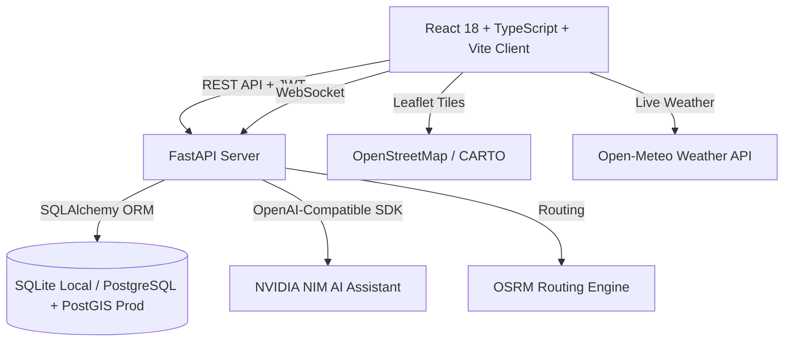

# SafeSphere • SIH26191

> **"Safer People. Stronger Tomorrow."**  
> *Smart India Hackathon 2026 — Disaster Management / Climate & Environmental Intelligence*

---

## 📌 Project Overview

| Attribute | Details |
| :--- | :--- |
| **Project Name** | **SafeSphere** |
| **Tagline** | *Safer People. Stronger Tomorrow.* |
| **Problem Statement ID** | **SIH26191** |
| **Problem Statement** | *Intelligent Identification of Hazard-Based Red Zones, Carrying Capacity Assessment, and Immediate Relocation Needs for Vulnerable Habitations* |
| **Theme** | Disaster Management / Climate & Environmental Intelligence |
| **Category** | Software |
| **Institute** | **VSB Engineering College (Autonomous)** |

### 👥 Team Details

* **Team Leader:** Nadin S
* **Team Members:**
  1. Nadin S
  2. Jayanthan P
  3. Kannan C
  4. Savithraaparkavi K S
  5. Suriya N
  6. Shathika Sri S

---

## 🎯 Core Mission & Capabilities

SafeSphere is a disaster-management decision-support platform designed for citizens, state authorities, district collectors, and field rescue teams. It delivers:

1. **Habitation-Level Risk Intelligence:** Multi-factor explainable risk scoring evaluating 10 physical and demographic parameters.
2. **Dynamic Red Zone Delineation:** Transparent categorization of high-risk habitations requiring immediate intervention.
3. **Emergency SOS Transmit:** High-visibility red SOS button with live GPS capture, hazard type classification, people count, and special needs weighting.
4. **Relocation Site Optimization:** Ranks candidate relocation sites using the Haversine formula, available carrying capacity, infrastructure readiness, and future safety.
5. **Family Safety Network:** Private family circles with one-tap status check-ins (`Safe`, `Need Help`, `At Shelter`), voice safety updates, and optional location sharing.
6. **Future Planning Risk Horizons:** Explainable risk trend projections across 1, 5, 10, and 20-year horizons for civil planning (explicitly distinct from exact-date disaster predictions).
7. **Multilingual & Voice-Driven Accessibility:** 6 Indian languages with hands-free voice command recognition for emergency situations.

---

## 🏗 Technology Stack



* **Frontend:**
  * React 18 with TypeScript and Vite
  * Pure White + Light-Blue Liquid-Glass Theme (translucent glass cards, backdrop blur, soft shadows, rounded corners)
  * Prominent **Red Emergency SOS Button**
  * Leaflet / React-Leaflet GIS mapping
  * `i18next` with Indian multilingual locale resources
  * Web Speech API for voice command recognition and audio feedback
* **Backend:**
  * Python 3.11+ / FastAPI with Uvicorn ASGI server
  * SQLAlchemy 2.0 ORM with Pydantic v2 validation
  * Passlib with bcrypt password hashing
  * PyJWT for stateless role-protected authentication
* **Databases:**
  * **Development:** SQLite (`disaster.db`) with zero-config startup
  * **Production:** PostgreSQL 16 with PostGIS spatial extension
* **AI & External Services:**
  * NVIDIA NIM (Meta Llama 3.3 70B Instruct) grounded disaster decision support
  * Open-Meteo precipitation, wind, and temperature feeds
  * OSRM road network routing engine

---

## 🔑 Demo Accounts & Roles

The system automatically initializes 5 verified demo accounts with bcrypt password hashes on startup:

| Role | Email | Password | Landing Route | Access Scope |
| :--- | :--- | :--- | :--- | :--- |
| **Administrator** | `admin.safesphere@gmail.com` | `Admin123!` | `/admin/dashboard` | Full system control, user management, audit logs |
| **Citizen** | `user.safesphere@gmail.com` | `User123!` | `/citizen/home` | Liquid dashboard, SOS, hazard report, family safety, map |
| **Authority** | `authority.safesphere@gmail.com` | `Authority123!` | `/authority/dashboard` | Command center, SOS priority queue, red zones, relocation |
| **Field Officer** | `officer.safesphere@gmail.com` | `Officer123!` | `/field/dashboard` | Incident dispatch, live verification, response acknowledgment |
| **Family Member** | `family.safesphere@gmail.com` | `Family123!` | `/family/home` | Family status monitoring, check-ins, shelter navigation |

---

## 📦 Core Modules Breakdown

### 1. Multi-Role Authentication & Access Control
* Canonical 5-role taxonomy (`admin`, `citizen`, `authority`, `field_officer`, `family_member`).
* Role-protected client routing (`RoleProtectedRoute.tsx`) and backend API endpoint enforcement (`require_roles`).
* Persistent "Remember Me" toggle (supporting `localStorage` vs session-scoped tokens).

### 2. Liquid-Glass Citizen Dashboard
* Pure white + light-blue liquid-glass interface tokens (`rgba(255, 255, 255, 0.85)` cards, soft blur, `rgba(16, 52, 92, 0.06)` shadows).
* Real-time network status pill (Online vs Offline Cache).
* Live weather and regional alert cards powered by Open-Meteo.
* Dynamic live synchronized date and clock widget (`LiveClock.tsx`).

### 3. Emergency SOS System
* **Prominent Red Floating Button** and full-page emergency transmitter.
* Form capture:
  * Automatic high-accuracy GPS coordinates (with explicit permission handling).
  * 8 Supported Hazards: **Flood**, **Landslide**, **Cyclone**, **Fire**, **Earthquake**, **Heavy Rain**, **Medical Emergency**, **Other**.
  * Number of people needing rescue.
  * Special assistance tags (`Elderly`, `Infant/Child`, `Disabled/Mobility`, `Medical Patient`).
  * Text/voice transcript description.
* **Priority Scoring Algorithm:**
  $$\text{Priority} = 45 + \text{Hazard Bonus} + \min(20, \text{Special Needs} \times 5) + \min(12, (\text{People} - 1) \times 2) + \text{Urgent Keyword Bonus}$$
* Higher-priority requests automatically sort to the top of authority queues.

### 4. Browser GPS & Geolocation
* Utilizes HTML5 Geolocation API with explicit user consent.
* Graceful fallback when location permission is denied.
* Transparent UI stating: *"Browser permission is required; the website cannot turn GPS on by itself."*

### 5. Leaflet Interactive Risk Map
* Live layer switching between Habitations, Hazard Zones, Verified Citizen Reports, and Relocation Shelters.
* Color-coded risk markers (Safe $\rightarrow$ Green, Moderate $\rightarrow$ Yellow, High $\rightarrow$ Orange, Critical $\rightarrow$ Red).
* Click-to-inspect popups showing habitation population, vulnerability score, and shelter capacity.

### 6. Explainable Weighted Multi-Factor Risk Assessment
* Evaluates habitations on an explainable 0–100 score:
  * `0.0 – 34.9`: **Safe**
  * `35.0 – 59.9`: **Moderate**
  * `60.0 – 79.9`: **High**
  * `80.0 – 100.0`: **Critical**
* Factors: Verified hazard history (0.24), Vulnerability (0.15), Infrastructure vulnerability (0.12), Drainage vulnerability (0.11), Rainfall trend (0.12), Elevation, River proximity, Terrain/Slope, Land-use change, Population growth.
* Every factor contribution is transparently exposed for auditability.

### 7. Future Planning Risk Estimation
* Projects relative planning trends over **1-year**, **5-year**, **10-year**, and **20-year** horizons.
* Explicitly documented as a planning preparedness estimate (not an exact-date disaster prediction).

### 8. Relocation Site Optimizer
* Evaluates relocation destinations using the **Haversine formula** for spherical distance:
  $$d = 2r \arcsin\left(\sqrt{\sin^2\left(\frac{\Delta \phi}{2}\right) + \cos(\phi_1)\cos(\phi_2)\sin^2\left(\frac{\Delta \lambda}{2}\right)}\right)$$
* Weighted multi-criteria ranking:
  $$\text{Score} = w_{\text{cap}} \cdot \text{Capacity} + w_{\text{safety}} \cdot \text{Future Safety} + w_{\text{infra}} \cdot \text{Infrastructure} + w_{\text{dist}} \cdot \text{Proximity}$$
* Ranks sites and flags capacity sufficiency for the target population.

### 9. Family Safety Portal
* Household members connect using a unique 6-character private **Family Join Code**.
* Instant check-in status updates: `Safe`, `At Shelter`, `Need Help`.
* Location sharing switch and timestamped member logs.

### 10. Citizen Hazard Reporting
* Citizens can upload GPS-tagged observations with photos/evidence.
* Authority and Field Officers review incoming reports in the verification queue (`verified` / `rejected`).

### 11. Multilingual Support
* 6 Languages supported:
  * 🇮🇳 **English (India)** — `en-IN` (Default)
  * **தமிழ் (Tamil)** — `ta-IN`
  * **हिन्दी (Hindi)** — `hi-IN`
  * **తెలుగు (Telugu)** — `te-IN`
  * **മലയാളം (Malayalam)** — `ml-IN`
  * **ಕನ್ನಡ (Kannada)** — `kn-IN`
* Preserves internal database/enum constants while translating user-facing labels.
* State persists in `localStorage` (`safesphere_language`).

### 12. Voice Command Recognition
* Hands-free voice recognition with emergency keyword matching in English and Tamil.
* Recognized phrases: *"Send SOS"*, *"Report flood"*, *"I need help"*, *"உதவி வேண்டும்"*, *"நான் பாதுகாப்பாக இருக்கிறேன்"*.

### 13–15. Role-Dedicated Dashboards
* **Administrator:** Platform analytics, user role delegation, audit trail, server status.
* **Authority:** Real-time SOS dispatch queue, red zone declaration, evacuation management.
* **Field Officer:** Operational incident assignment, field verification, live response tracking.

### 16. Offline Resilience
* Service worker caching and fallback banners for disconnected operation.

### 17. Live Weather
* Real-time temperature, precipitation, and rain detection via Open-Meteo.

### 18. Route Optimization
* Turn-by-turn evacuation routing powered by Open Source Routing Machine (OSRM).

### 19. Grounded AI Decision Support
* Configured through `.env` (`AI_ENABLED`, `AI_BASE_URL`, `AI_API_KEY`, `AI_MODEL`).
* Uses Meta Llama 3.3 70B Instruct for situational awareness without hallucinating emergency protocols.

### 20. Hardened Security
* Salted bcrypt password hashing.
* JWT stateless bearer token authentication.
* Strict CORS origin filtering.
* Secrets and local databases protected via `.gitignore`.

---

## 🚀 Quick Start Guide

### Prerequisites
* **Node.js:** v18 or later
* **Python:** v3.11 or later
* **Git**

### Automated Windows 1-Click Launch
Double-click `START_LOCAL.bat` in the project root:
```cmd
START_LOCAL.bat
```
This script automatically:
1. Creates the Python virtual environment (`.venv`) if missing.
2. Installs backend dependencies (`requirements.txt`).
3. Installs frontend dependencies (`npm install`).
4. Seeds the 5 demo accounts.
5. Launches FastAPI on `http://127.0.0.1:8000` and Vite on `http://localhost:5173`.

To stop the servers, run `STOP_PROJECT.bat`.

---

### Manual Step-by-Step Setup

#### 1. Backend Setup
```bash
cd backend
python -m venv .venv

# Windows
.\.venv\Scripts\activate
# Linux/macOS
source .venv/bin/activate

pip install -r requirements.txt
python -m app.services.seed_service
uvicorn app.main:app --port 8000 --reload
```
*API Swagger Documentation is available at:* `http://127.0.0.1:8000/docs`

#### 2. Frontend Setup
```bash
cd frontend
npm install
npm run dev
```
*Application UI is available at:* `http://localhost:5173`

---

## 🧪 Testing & Verification

Run the automated backend test suite:
```bash
cd backend
.\.venv\Scripts\pytest tests/ -v
```
All 14 unit and integration test fixtures validate password hashing, JWT expiration, role-based route guard security, and demo user seeding.

Compile frontend TypeScript:
```bash
cd frontend
npm run build
```

---

## 📄 License & Intellectual Property
Developed by **Team SafeSphere** from **VSB Engineering College (Autonomous)** for the **Smart India Hackathon 2026** (Problem Statement ID: **SIH26191**).
